# Inline Project - Complete Architecture & Pipeline

> **Inline** - Privacy-first offline AI code completion VS Code extension
> 
> Version: 0.1.0 | License: Apache 2.0

---

## 📋 Table of Contents

1. [Project Overview](#project-overview)
2. [High-Level Architecture](#high-level-architecture)
3. [Build & Development Pipeline](#build--development-pipeline)
4. [Package Structure](#package-structure)
5. [Data Flow Pipeline](#data-flow-pipeline)
6. [CI/CD Pipeline](#cicd-pipeline)
7. [Testing Pipeline](#testing-pipeline)
8. [Technology Stack](#technology-stack)

---

## Project Overview

**Inline** is an offline-first VS Code extension that provides AI-powered code completion entirely locally. All processing happens on the user's machine with no external API calls.

### Core Capabilities
- 🔒 **Privacy-First**: 100% offline, no data leaves your machine
- 🚀 **High Performance**: Rust + C++ native modules for speed
- 🌳 **Smart Context**: Tree-sitter based semantic analysis
- 🤖 **Model Management**: GGUF model support via llama.cpp
- 🎨 **Modern UI**: Native VS Code webview integration
- 🌍 **40+ Languages**: Comprehensive language support

---

## High-Level Architecture

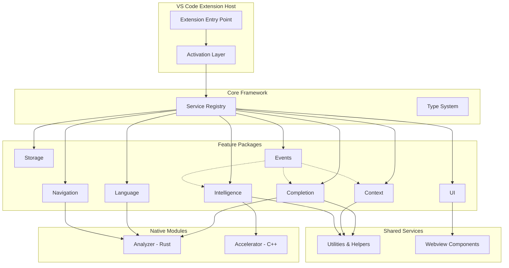

---

## Build & Development Pipeline

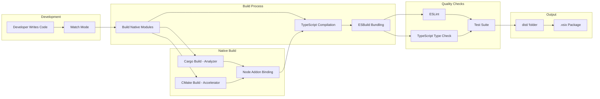

### Build Commands

| Command | Description | Pipeline Stage |
|---------|-------------|----------------|
| `pnpm install` | Install dependencies | Setup |
| `pnpm build:native` | Build Rust + C++ modules | Native Compilation |
| `pnpm compile` | Compile TypeScript | TypeScript Build |
| `pnpm build` | Full build (native + compile) | Complete Build |
| `pnpm watch` | Watch mode for development | Development |
| `pnpm lint` | Run ESLint | Quality Check |
| `pnpm check-types` | TypeScript type checking | Quality Check |
| `pnpm test` | Run all tests | Testing |
| `pnpm validate` | Run all checks | Validation |

---

## Package Structure

```mermaid
graph TB
    subgraph "Root Workspace"
        ROOT[inline/]
    end

    subgraph "Core Packages"
        CORE[packages/core]
        SHARED[packages/shared]
        EXT[packages/extension]
        WEBVIEW[packages/webview]
    end

    subgraph "Feature Packages"
        COMPLETION[packages/features/completion]
        CONTEXT[packages/features/context]
        INTELLIGENCE[packages/features/intelligence]
        LANGUAGE[packages/features/language]
        NAVIGATION[packages/features/navigation]
        STORAGE[packages/features/storage]
        UI_PKG[packages/features/ui]
        EVENTS[packages/features/events]
    end

    subgraph "Native Packages"
        ANALYZER[packages/analyzer - Rust]
        ACCELERATOR[packages/accelerator - C++]
    end

    ROOT --> CORE
    ROOT --> SHARED
    ROOT --> EXT
    ROOT --> WEBVIEW
    ROOT --> COMPLETION
    ROOT --> CONTEXT
    ROOT --> INTELLIGENCE
    ROOT --> LANGUAGE
    ROOT --> NAVIGATION
    ROOT --> STORAGE
    ROOT --> UI_PKG
    ROOT --> EVENTS
    ROOT --> ANALYZER
    ROOT --> ACCELERATOR

    EXT -.depends on.-> CORE
    EXT -.depends on.-> SHARED
    EXT -.depends on.-> COMPLETION
    EXT -.depends on.-> CONTEXT
    EXT -.depends on.-> INTELLIGENCE
    EXT -.depends on.-> LANGUAGE
    EXT -.depends on.-> NAVIGATION
    EXT -.depends on.-> STORAGE
    EXT -.depends on.-> UI_PKG
    EXT -.depends on.-> EVENTS
    EXT -.depends on.-> ANALYZER
    EXT -.depends on.-> ACCELERATOR
    EXT -.depends on.-> WEBVIEW
```

### Package Details

#### 1. **@inline/core**
- **Purpose**: Core framework and service registry
- **Contents**: 
  - Service registry pattern
  - Type system definitions
  - Base interfaces
- **Dependencies**: None (foundation package)

#### 2. **@inline/shared**
- **Purpose**: Shared utilities and helpers
- **Contents**:
  - Common utilities
  - Helper functions
  - Shared constants
- **Dependencies**: None

#### 3. **@inline/extension**
- **Purpose**: Main VS Code extension entry point
- **Contents**:
  - Extension activation
  - Feature orchestration
  - VS Code API integration
- **Dependencies**: All other packages

#### 4. **@inline/completion**
- **Purpose**: Code completion engine
- **Contents**:
  - Completion providers
  - Generation strategies
  - Filtering & ranking
  - Rendering logic
- **Key Features**:
  - Ghost text rendering
  - Streaming completions
  - Partial acceptance
  - Cache warming

#### 5. **@inline/context**
- **Purpose**: Context extraction and management
- **Contents**:
  - Context builders
  - Cross-file analysis
  - Symbol resolution
- **Key Features**:
  - Smart context detection
  - Import tracking
  - Related file discovery

#### 6. **@inline/intelligence**
- **Purpose**: AI/ML inference engine
- **Contents**:
  - Model management
  - Inference engines
  - Optimization layer
  - Processing pipeline
- **Subdirectories**:
  - `analysis/` - Code analysis
  - `engines/` - Inference engines
  - `models/` - Model handlers
  - `optimization/` - Performance optimization
  - `processing/` - Data processing

#### 7. **@inline/language**
- **Purpose**: Language-specific support
- **Contents**:
  - Tree-sitter integration
  - Language parsers
  - Semantic analysis
  - Syntax validation
- **Supported**: 40+ programming languages

#### 8. **@inline/navigation**
- **Purpose**: Code navigation features
- **Contents**:
  - Go to Definition
  - Find References
  - Rename Symbol
  - Symbol extraction

#### 9. **@inline/storage**
- **Purpose**: Data persistence layer
- **Contents**:
  - Cache management
  - Configuration storage
  - Model storage

#### 10. **@inline/ui**
- **Purpose**: User interface components
- **Contents**:
  - Webview providers
  - Status bar integration
  - Model manager UI

#### 11. **@inline/events**
- **Purpose**: Event system
- **Contents**:
  - Event bus
  - Event handlers
  - Cross-feature communication

#### 12. **@inline/webview**
- **Purpose**: Webview UI components
- **Contents**:
  - React/HTML components
  - CSS styling
  - UI assets

#### 13. **@inline/analyzer** (Native - Rust)
- **Purpose**: High-performance code analysis
- **Technology**: Rust + Tree-sitter
- **Build**: Cargo + napi-rs
- **Output**: `.node` binary

#### 14. **@inline/accelerator** (Native - C++)
- **Purpose**: GPU acceleration for inference
- **Technology**: C++ + CUDA/Metal
- **Build**: CMake + node-gyp
- **Output**: `.node` binary

---

## Data Flow Pipeline

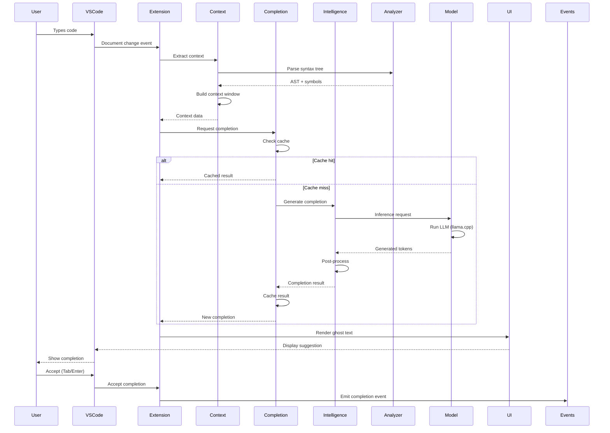

### Detailed Flow Stages

#### Stage 1: Context Extraction


#### Stage 2: Completion Generation
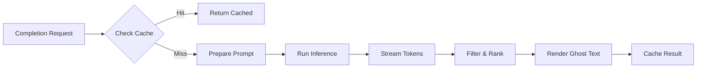

#### Stage 3: Model Inference
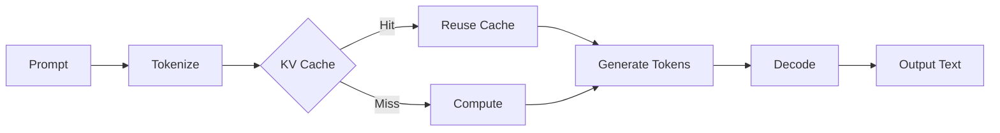

---

## CI/CD Pipeline

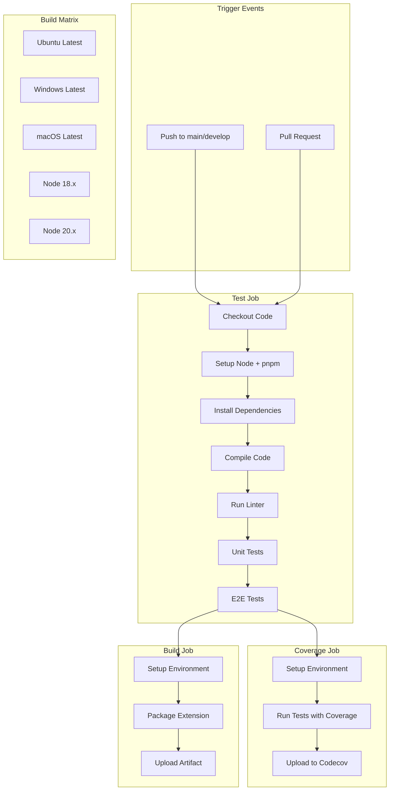

### CI/CD Configuration

**File**: `.github/workflows/ci.yml`

**Jobs**:
1. **Test** - Runs on Ubuntu, Windows, macOS with Node 18.x and 20.x
2. **Coverage** - Generates code coverage and uploads to Codecov
3. **Build** - Packages the extension as `.vsix` file

---

## Testing Pipeline

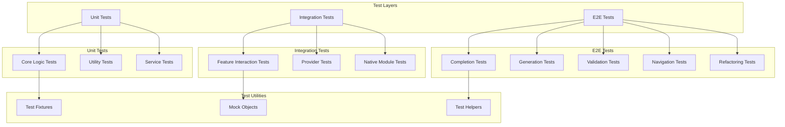

### Test Commands

| Command | Description | Coverage |
|---------|-------------|----------|
| `pnpm test` | Run all tests | Full suite |
| `pnpm test:unit` | Unit tests only | Fast feedback |
| `pnpm test:e2e` | E2E tests only | Full integration |
| `pnpm test:e2e:completion` | Completion E2E | Feature-specific |
| `pnpm test:e2e:generation` | Generation E2E | Feature-specific |
| `pnpm test:e2e:validation` | Validation E2E | Feature-specific |
| `pnpm test:e2e:navigation` | Navigation E2E | Feature-specific |
| `pnpm test:coverage` | Coverage report | Metrics |
| `pnpm test:benchmark` | Performance benchmarks | Performance |

---

## Technology Stack

### Core Technologies

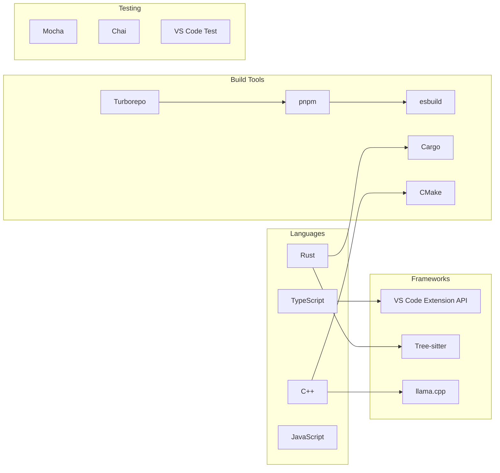

### Technology Details

#### Frontend
- **TypeScript 5.9.3**: Type-safe development
- **VS Code Extension API 1.80.0+**: Extension framework
- **React**: Webview UI components
- **ESBuild**: Fast bundling

#### Backend/Native
- **Rust**: High-performance code analysis
  - Tree-sitter bindings
  - napi-rs for Node.js bindings
- **C++**: GPU acceleration
  - CUDA/Metal support
  - CMake build system
  - node-gyp bindings

#### AI/ML
- **llama.cpp**: LLM inference engine
- **GGUF Models**: Quantized model format
- **node-llama-cpp 3.14.4**: Node.js bindings

#### Build System
- **Turborepo 2.6.3**: Monorepo orchestration
- **pnpm 10.25.0**: Fast package manager
- **Workspace Protocol**: Package linking

#### Testing
- **Mocha 11.7.5**: Test framework
- **Chai 4.3.10**: Assertion library
- **@vscode/test-electron**: VS Code testing
- **Vitest 4.0.15**: Unit testing

#### Code Quality
- **ESLint 9.39.1**: Linting
- **TypeScript Compiler**: Type checking
- **Prettier**: Code formatting

---

## Configuration Files

### Root Configuration

| File | Purpose | Technology |
|------|---------|------------|
| `package.json` | Root workspace config | pnpm workspace |
| `pnpm-workspace.yaml` | Workspace definition | pnpm |
| `turbo.json` | Build orchestration | Turborepo |
| `tsconfig.base.json` | Base TypeScript config | TypeScript |
| `tsconfig.json` | Root TypeScript config | TypeScript |
| `.eslintrc.yml` | ESLint rules | ESLint |
| `.editorconfig` | Editor consistency | EditorConfig |
| `.nvmrc` | Node version | nvm |
| `.gitignore` | Git ignore patterns | Git |

### Package-Specific

Each package has:
- `package.json` - Package metadata and scripts
- `tsconfig.json` - TypeScript configuration
- `src/` - Source code
- `dist/` - Build output

### Native Modules

**Analyzer (Rust)**:
- `Cargo.toml` - Rust dependencies
- `build.rs` - Build script
- `src/lib.rs` - Entry point

**Accelerator (C++)**:
- `CMakeLists.txt` - CMake configuration
- `binding.gyp` - Node.js binding
- `src/` - C++ source

---

## File System Structure

```
inline/
├── .github/
│   └── workflows/
│       └── ci.yml                    # CI/CD pipeline
├── .vscode/
│   ├── launch.json                   # Debug configuration
│   └── tasks.json                    # VS Code tasks
├── docs/
│   ├── architecture/                 # Architecture docs
│   ├── guides/                       # User guides
│   └── FOLDER_STRUCTURE.md          # Project structure
├── packages/
│   ├── core/                         # @inline/core
│   │   ├── src/
│   │   │   ├── registry/            # Service registry
│   │   │   ├── types/               # Type definitions
│   │   │   └── index.ts
│   │   ├── package.json
│   │   └── tsconfig.json
│   ├── shared/                       # @inline/shared
│   │   ├── src/
│   │   ├── package.json
│   │   └── tsconfig.json
│   ├── extension/                    # @inline/extension
│   │   ├── src/
│   │   │   ├── activation/          # Extension activation
│   │   │   ├── features/            # Feature integration
│   │   │   └── resources/           # Resources
│   │   ├── test/                    # Test suites
│   │   │   ├── suites/
│   │   │   │   ├── unit/           # Unit tests
│   │   │   │   ├── integration/    # Integration tests
│   │   │   │   └── e2e/            # E2E tests
│   │   │   ├── fixtures/           # Test data
│   │   │   └── utilities/          # Test utilities
│   │   ├── package.json
│   │   ├── tsconfig.json
│   │   └── esbuild.js              # Build configuration
│   ├── webview/                      # @inline/webview
│   │   ├── src/
│   │   ├── package.json
│   │   └── tsconfig.json
│   ├── analyzer/                     # @inline/analyzer (Rust)
│   │   ├── src/
│   │   ├── Cargo.toml
│   │   └── build.rs
│   ├── accelerator/                  # @inline/accelerator (C++)
│   │   ├── src/
│   │   ├── CMakeLists.txt
│   │   └── binding.gyp
│   └── features/
│       ├── completion/               # @inline/completion
│       │   ├── src/
│       │   │   ├── providers/       # Completion providers
│       │   │   ├── generation/      # Generation logic
│       │   │   ├── filtering/       # Result filtering
│       │   │   ├── rendering/       # UI rendering
│       │   │   ├── optimization/    # Performance
│       │   │   └── services/        # Services
│       │   ├── package.json
│       │   └── tsconfig.json
│       ├── context/                  # @inline/context
│       │   ├── src/
│       │   ├── package.json
│       │   └── tsconfig.json
│       ├── intelligence/             # @inline/intelligence
│       │   ├── src/
│       │   │   ├── analysis/        # Code analysis
│       │   │   ├── engines/         # Inference engines
│       │   │   ├── models/          # Model management
│       │   │   ├── optimization/    # Optimization
│       │   │   ├── processing/      # Data processing
│       │   │   └── registry/        # Service registry
│       │   ├── package.json
│       │   └── tsconfig.json
│       ├── language/                 # @inline/language
│       │   ├── src/
│       │   │   ├── analysis/        # Semantic analysis
│       │   │   ├── parsers/         # Language parsers
│       │   │   └── validation/      # Syntax validation
│       │   ├── package.json
│       │   └── tsconfig.json
│       ├── navigation/               # @inline/navigation
│       │   ├── src/
│       │   │   ├── providers/       # Navigation providers
│       │   │   └── services/        # Symbol services
│       │   ├── package.json
│       │   └── tsconfig.json
│       ├── storage/                  # @inline/storage
│       │   ├── src/
│       │   ├── package.json
│       │   └── tsconfig.json
│       ├── ui/                       # @inline/ui
│       │   ├── src/
│       │   ├── package.json
│       │   └── tsconfig.json
│       └── events/                   # @inline/events
│           ├── src/
│           ├── package.json
│           └── tsconfig.json
├── resources/
│   ├── cache/                        # Runtime cache (gitignored)
│   ├── config/                       # User config (gitignored)
│   ├── models/                       # LLM models (gitignored)
│   └── webview/                      # UI assets
├── scripts/
│   ├── setup.sh                      # Setup script
│   ├── build-native.sh              # Native build script
│   ├── release.sh                   # Release automation
│   ├── reset.sh                     # Clean script
│   ├── benchmark-llm.js             # LLM benchmarks
│   ├── benchmark-kv-cache.js        # Cache benchmarks
│   ├── optimize-configs.js          # Config optimization
│   ├── verify-implementation.js     # Implementation verification
│   └── generate-queries.py          # Query generation
├── models/                           # Model storage (runtime)
├── out/                              # Build output (gitignored)
├── node_modules/                     # Dependencies (gitignored)
├── .editorconfig                     # Editor config
├── .eslintrc.yml                     # ESLint config
├── .eslintignore                     # ESLint ignore
├── .gitignore                        # Git ignore
├── .nvmrc                            # Node version
├── .npmrc                            # npm config
├── .pnpmrc                           # pnpm config
├── .vscode-test.mjs                 # VS Code test config
├── .vscodeignore                    # VS Code package ignore
├── CHANGELOG.md                      # Version history
├── LICENSE                           # Apache 2.0 license
├── README.md                         # Documentation
├── SECURITY.md                       # Security policy
├── package.json                      # Root package config
├── pnpm-lock.yaml                   # Dependency lock
├── pnpm-workspace.yaml              # Workspace config
├── tsconfig.base.json               # Base TS config
├── tsconfig.json                    # Root TS config
└── turbo.json                       # Turborepo config
```

---

## Development Workflow

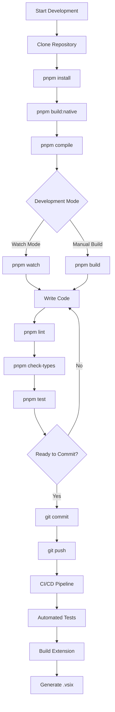

---

## Deployment Pipeline

```mermaid
flowchart LR
    subgraph "Local Development"
        DEV[Development]
        BUILD[Build]
        TEST[Test]
    end

    subgraph "Version Control"
        COMMIT[Commit]
        PUSH[Push]
        PR[Pull Request]
    end

    subgraph "CI/CD"
        CI_TEST[CI Tests]
        CI_BUILD[CI Build]
        PACKAGE[Package .vsix]
    end

    subgraph "Release"
        TAG[Git Tag]
        RELEASE[GitHub Release]
        MARKETPLACE[VS Code Marketplace]
    end

    DEV --> BUILD
    BUILD --> TEST
    TEST --> COMMIT
    COMMIT --> PUSH
    PUSH --> PR
    PR --> CI_TEST
    CI_TEST --> CI_BUILD
    CI_BUILD --> PACKAGE
    PACKAGE --> TAG
    TAG --> RELEASE
    RELEASE --> MARKETPLACE
```

---

## Performance Optimization Pipeline

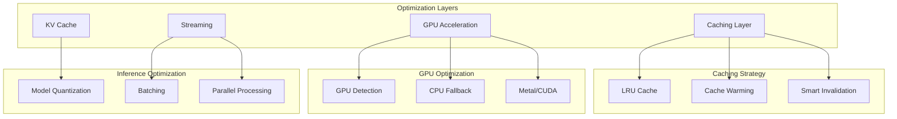

---

## Supported Languages (40+)

### Language Categories

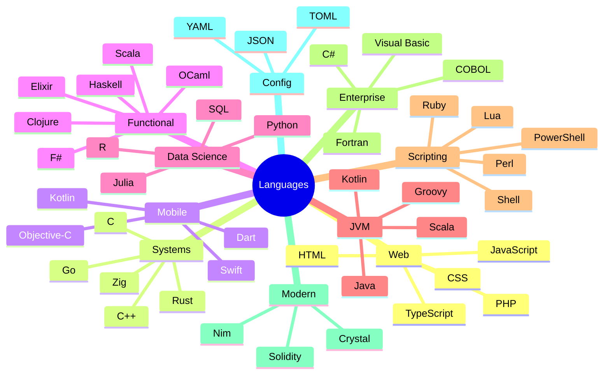

---

## Model Support Pipeline

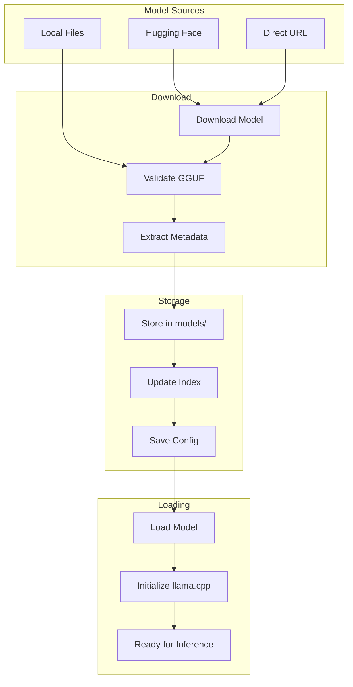

### Recommended Models by Tier

| Tier | VRAM | Models |
|------|------|--------|
| **Lightweight** | 2-4 GB | CodeGemma-2B, StableCode-3B, Phi-3-mini, TinyLlama-1.1B |
| **Mid-Tier** | 6-8 GB | DeepSeek-Coder-6.7B, StarCoder2-7B, CodeLlama-7B |
| **Heavy** | 12GB+ | CodeLlama-13B, Mixtral (Quantized) |
| **Ultra** | 24GB+ | CodeLlama-34B, Llama-3-70B (Quantized) |

---

## Security & Privacy

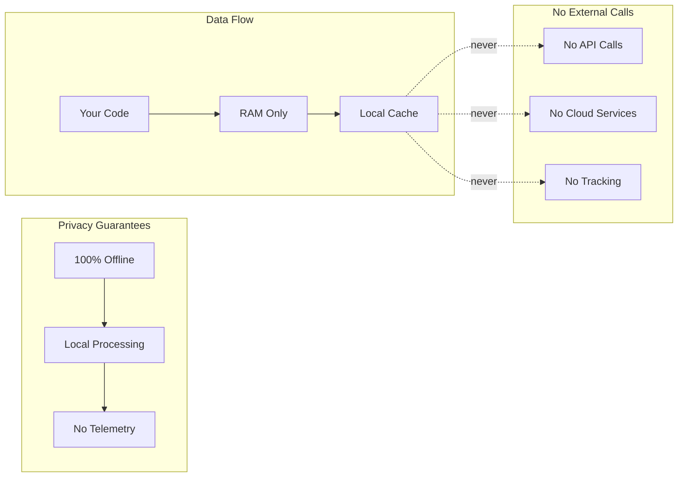

---

## Extension Lifecycle

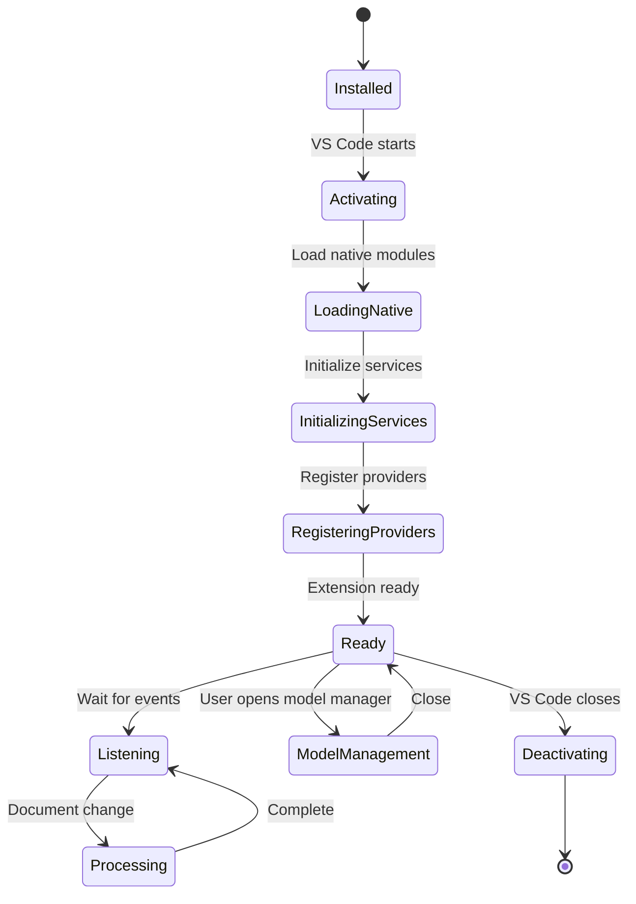

---

## Resource Management

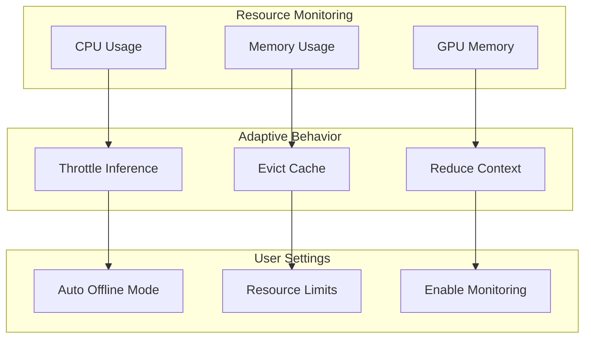

---

## Key Features Implementation

### 1. Ghost Text Completion

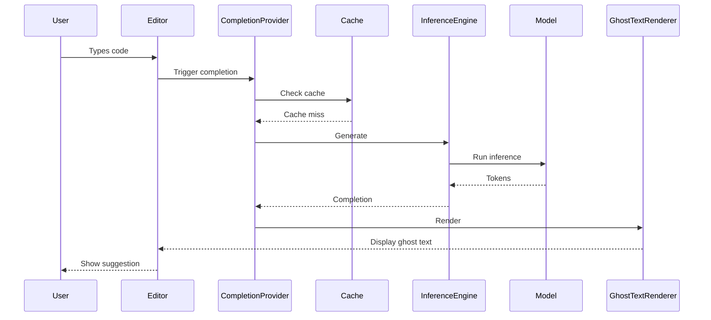

### 2. Streaming Completions


### 3. Cross-File Context

```mermaid
graph TB
    CURRENT[Current File] --> IMPORTS[Extract Imports]
    IMPORTS --> RESOLVE[Resolve Paths]
    RESOLVE --> PARSE[Parse Related Files]
    PARSE --> SYMBOLS[Extract Symbols]
    SYMBOLS --> CONTEXT[Build Context]
    CONTEXT --> COMPLETION[Generate Completion]
```

---

## Troubleshooting Pipeline

```mermaid
flowchart TB
    ISSUE[Issue Detected] --> TYPE{Issue Type}
    
    TYPE -->|Build Error| BUILD_FIX
    TYPE -->|Runtime Error| RUNTIME_FIX
    TYPE -->|Performance| PERF_FIX
    
    subgraph "Build Issues"
        BUILD_FIX[Check Build Logs]
        BUILD_FIX --> NATIVE_CHECK{Native Module?}
        NATIVE_CHECK -->|Yes| REBUILD_NATIVE[Rebuild Native]
        NATIVE_CHECK -->|No| REBUILD_TS[Rebuild TypeScript]
    end
    
    subgraph "Runtime Issues"
        RUNTIME_FIX[Check Extension Logs]
        RUNTIME_FIX --> VSCODE_VERSION{VS Code Version?}
        VSCODE_VERSION -->|Old| UPDATE_VSCODE[Update VS Code]
        VSCODE_VERSION -->|OK| CHECK_MODEL{Model Loaded?}
        CHECK_MODEL -->|No| LOAD_MODEL[Load Model]
        CHECK_MODEL -->|Yes| CHECK_SETTINGS[Check Settings]
    end
    
    subgraph "Performance Issues"
        PERF_FIX[Check Resource Usage]
        PERF_FIX --> HIGH_MEM{High Memory?}
        HIGH_MEM -->|Yes| CLEAR_CACHE[Clear Cache]
        HIGH_MEM -->|No| CHECK_MODEL_SIZE{Large Model?}
        CHECK_MODEL_SIZE -->|Yes| USE_SMALLER[Use Smaller Model]
    end
```

---

## Future Roadmap

```mermaid
timeline
    title Inline Development Roadmap
    section Q1 2024
        Core Features : Completion
                      : Navigation
                      : Model Management
    section Q2 2024
        Advanced Features : Multi-model support
                          : Custom training
                          : Team sharing
    section Q3 2024
        Enterprise : SSO integration
                   : Audit logging
                   : Policy management
    section Q4 2024
        AI Enhancements : Code review
                        : Bug detection
                        : Refactoring suggestions
```

---

## Summary

This document provides a comprehensive overview of the **Inline** project architecture, including:

✅ **14 packages** in a monorepo structure  
✅ **3-layer architecture**: Core → Features → Extension  
✅ **Native modules** for performance (Rust + C++)  
✅ **Complete CI/CD pipeline** with automated testing  
✅ **40+ supported languages** via Tree-sitter  
✅ **Privacy-first design** with 100% offline operation  
✅ **Advanced features**: Streaming, caching, GPU acceleration  
✅ **Comprehensive testing**: Unit, integration, E2E  

---

## Quick Reference

### Essential Commands
```bash
# Setup
pnpm install && pnpm build

# Development
pnpm watch

# Testing
pnpm test

# Build
pnpm build

# Package
vsce package
```

### Key Directories
- `packages/extension/` - Main extension
- `packages/features/` - Feature packages
- `packages/analyzer/` - Rust native module
- `packages/accelerator/` - C++ native module
- `scripts/` - Build and utility scripts
- `.github/workflows/` - CI/CD configuration

### Important Files
- `turbo.json` - Build orchestration
- `pnpm-workspace.yaml` - Workspace definition
- `tsconfig.base.json` - TypeScript configuration
- `.github/workflows/ci.yml` - CI/CD pipeline

---

**Generated**: 2025-12-19  
**Version**: 0.1.0  
**License**: Apache 2.0
