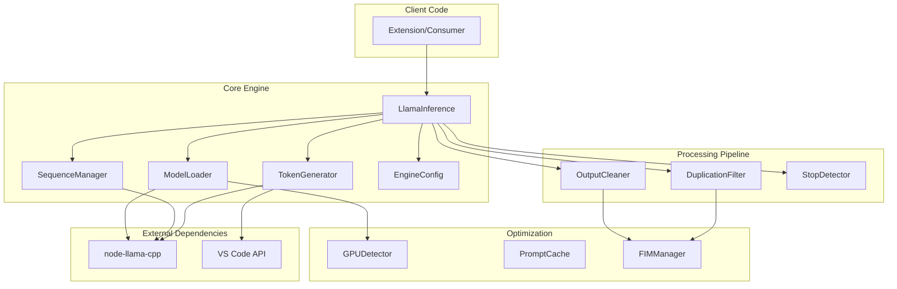
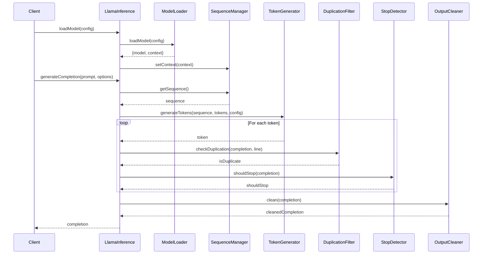
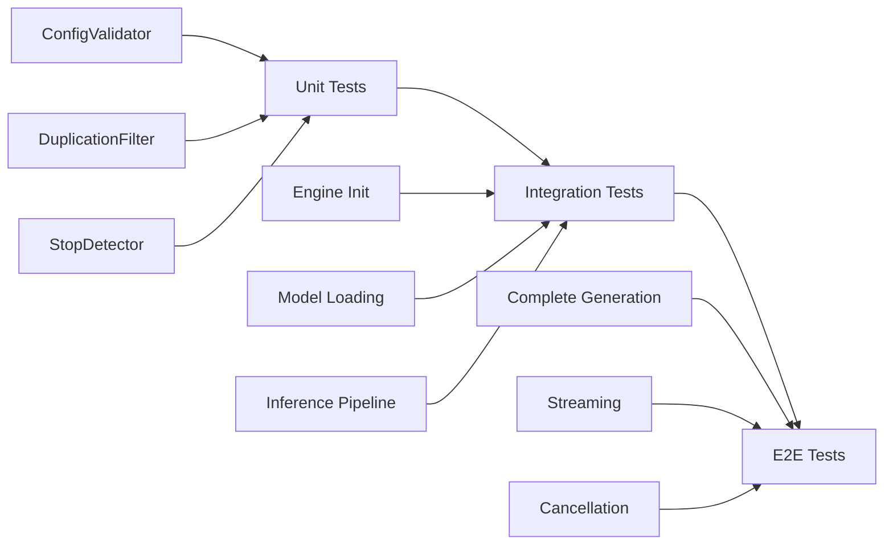

# Intelligence Engine Architecture

## Overview

The intelligence engine has been refactored from a monolithic 724-line file into a modular, scalable architecture with clear separation of concerns.

## Component Architecture



## Data Flow



## Component Responsibilities

### Core Engine Components

| Component | Responsibility | Key Methods |
|-----------|---------------|-------------|
| **EngineConfig** | Configuration management and validation | `validateEngineConfig()`, `validateInferenceConfig()` |
| **ModelLoader** | GGUF model loading and initialization | `loadModel()`, `unloadModel()`, `validateModelFile()` |
| **SequenceManager** | Sequence lifecycle and KV cache management | `getSequence()`, `disposeSequence()`, `startGeneration()` |
| **TokenGenerator** | Streaming token generation | `generateTokens()`, `generateCompletion()` |

### Processing Pipeline

| Component | Responsibility | Key Methods |
|-----------|---------------|-------------|
| **OutputCleaner** | Output cleaning and normalization | `clean()`, `normalizeWhitespace()` |
| **DuplicationFilter** | Duplication detection during generation | `checkDuplication()`, `isExactDuplicate()`, `isNearDuplicate()` |
| **StopDetector** | Stop condition management | `shouldStop()`, `isMaxTokensReached()`, `hasStopSequence()` |

### Optimization Layer

| Component | Responsibility | Key Methods |
|-----------|---------------|-------------|
| **GPUDetector** | GPU capability detection | `getOptimalGPULayers()`, `detectGPU()` |
| **PromptCache** | Prompt caching for performance | `get()`, `set()`, `clear()` |
| **FIMManager** | FIM template management | `setTemplate()`, `createPrompt()`, `clean()` |

## Design Patterns

### 1. **Separation of Concerns**
Each component has a single, well-defined responsibility:
- Configuration is separate from execution
- Loading is separate from inference
- Generation is separate from post-processing

### 2. **Dependency Injection**
Components receive their dependencies through constructors:
```typescript
class OutputCleaner {
    constructor(private fimManager: FIMManager) {}
}
```

### 3. **Strategy Pattern**
Different processing strategies can be swapped:
- Different FIM templates
- Different duplication detection strategies
- Different caching strategies

### 4. **Async Generators**
Token generation uses async generators for efficient streaming:
```typescript
async* generateTokens(...): AsyncGenerator<string, void, unknown>
```

## Extension Points

The architecture is designed to be easily extensible:

1. **New Model Types**: Implement new loaders by extending `ModelLoader`
2. **New Processing Steps**: Add new pipeline components
3. **New Stop Conditions**: Extend `StopDetector` with new checks
4. **New Caching Strategies**: Implement new cache managers
5. **New FIM Templates**: Add templates to `FIMManager`

## Testing Strategy



### Test Coverage Goals

- **Unit Tests**: 90%+ coverage for all components
- **Integration Tests**: All component interactions
- **E2E Tests**: All major user workflows

## Performance Considerations

1. **KV Cache Reuse**: `SequenceManager` maintains persistent sequences
2. **Lazy Loading**: Components initialized only when needed
3. **Streaming**: Async generators for memory efficiency
4. **GPU Optimization**: Automatic GPU layer detection
5. **Prompt Caching**: Frequently used prompts cached

## Migration Path

The refactoring maintains backward compatibility:

1. **Phase 1**: New components created alongside existing code ✅
2. **Phase 2**: Tests added for new components ✅ (partial)
3. **Phase 3**: Refactor `LlamaInference` to use new components (TODO)
4. **Phase 4**: Deprecate old code paths (TODO)
5. **Phase 5**: Remove deprecated code (TODO)

## Benefits

1. **Modularity**: Easy to understand and modify individual components
2. **Testability**: Each component can be tested in isolation
3. **Maintainability**: Changes are localized to specific components
4. **Scalability**: Easy to add new features without breaking existing code
5. **Performance**: Optimized caching and resource management
6. **Type Safety**: Full TypeScript coverage prevents runtime errors

## Next Steps

See [implementation_plan.md](file:///Users/ratulhasan/.gemini/antigravity/brain/ffdbf1e4-33ba-4072-b7a8-495ada532d0b/implementation_plan.md) for detailed next steps and [walkthrough.md](file:///Users/ratulhasan/.gemini/antigravity/brain/ffdbf1e4-33ba-4072-b7a8-495ada532d0b/walkthrough.md) for implementation details.
